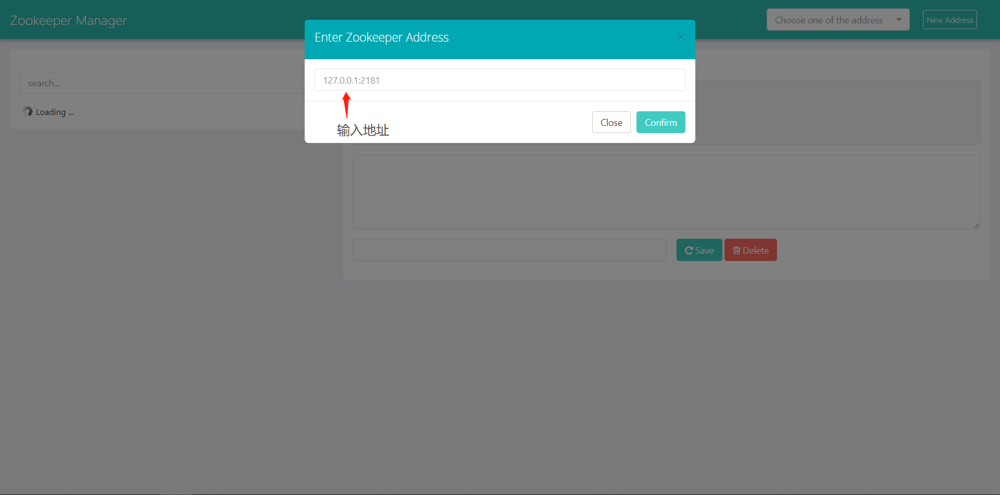
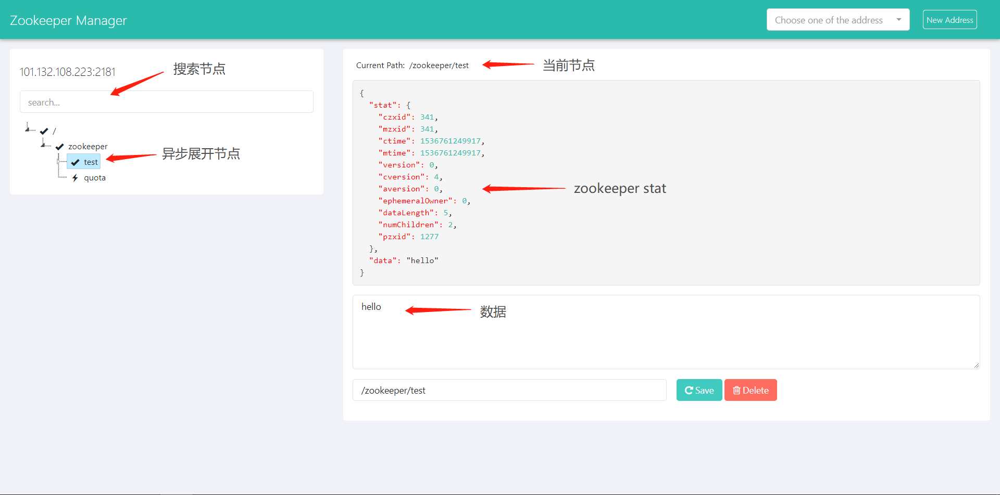
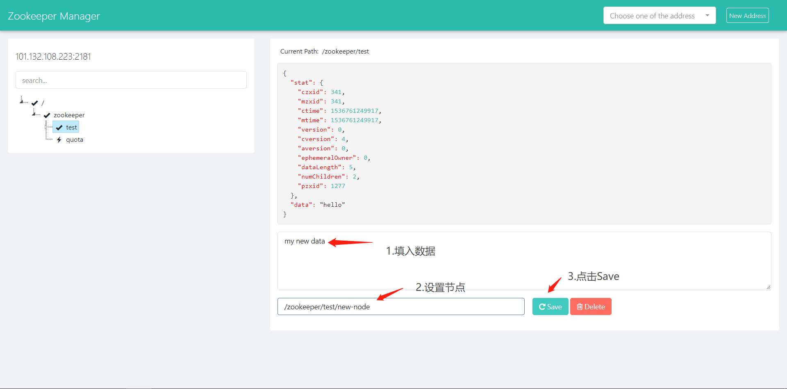
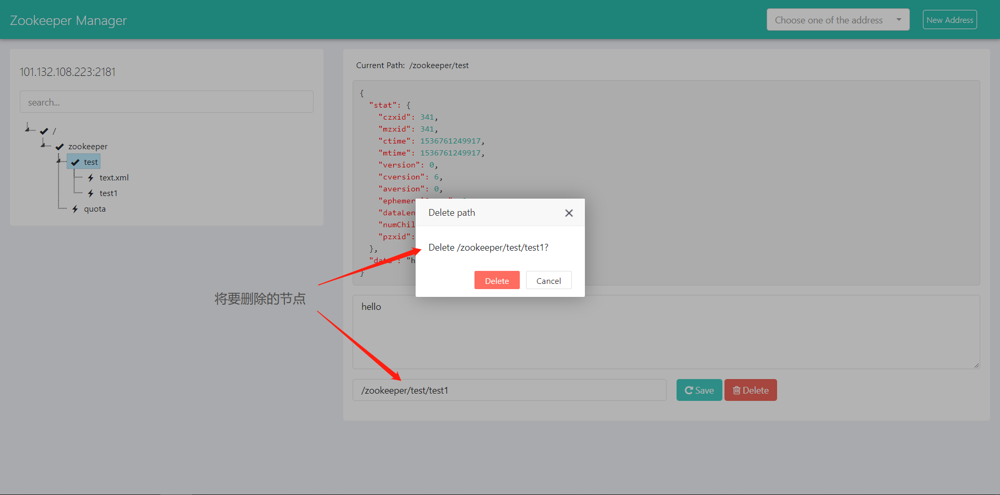
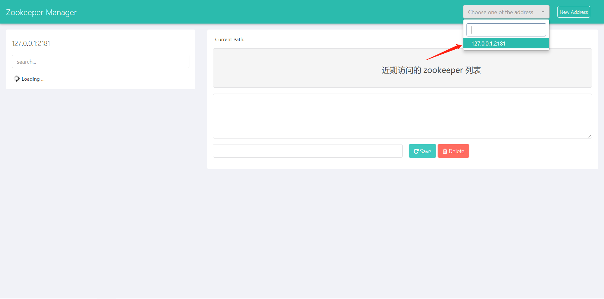

# zookeeper-manager 
> zookeeper 管理平台

### 简介

使用 apache curator 结合前端 jstree 实现对 zookeeper node 可视化的增、删、查、改，可以方便的管理 zookeeper

### 1. 添加 zookeeper 地址
  

### 2. 数据展示
  

### 3. 更新节点

用户可以更新节点或添加新节点

  

### 4. 删除节点
  

### 5. cookie 存储近期访问的 zookeeper 列表
  

